## **Overview**


There are a handful of steps that occur betwixt the time a user requests a web page and the time it displays in their browser. To better cover each of them, I've divided those steps into the following sections:

- [**Navigation**](https://dev.to/gitpaulo/journey-of-a-web-page-how-browsers-work-10co#navigation)
	- Resolving the web address (DNS Lookup)
	- Establishing a connection to the server (TCP 3-way handshake)
	- Establishing a security protocol (TLS negotiation)
- Fetching
	- HTTP request
	- HTTP response
- Parsing
	- Building the DOM tree
	- Building the DOM tree
	- Building the CSSOM tree
	- Combining the trees into the rendered tree
	- Preload Scanner
	- JavaScript Compilation
	- Building the Accessibility Tree
- Rendering
	- Critical Rendering Path
	- Layout
	- Paint
	- Compositing
- Finalizing
	- JavaScript Occupied.
	- Users can now browse the page!

Use this index to jump to any particular section of interest. If you're new to some of these concepts, I suggest a linear read. It is time for a quick background lesson!


## **Background**


This section contains a very _quick_ and _general_ overview of some of the core background concepts that are required to understand the later parts of the article.


### **Networking models**


Models exist to explain how data is transmitted through a network. In particular, there exists a network model so widely known that even those that do not partake in _hackerman_ things might've heard of! We call it the Open Systems Interconnected (OSI) model.


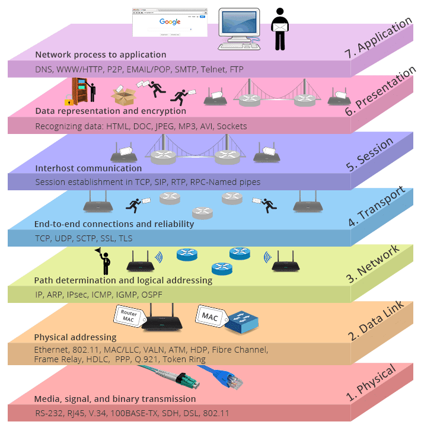


                                                                        _OSI Model_


[The Open Systems Interconnection (OSI) model](https://www.iso.org/ics/35.100/x/) describes seven layers that computer systems use to communicate over a network. Each upper layer is one level of abstraction higher than the previous, all the way up to the application (browser) layer which we will be talking about.


It’s important to understand that the OSI model is a “conceptual model” for how applications communicate over a network. It is **not** a protocol. Do not get the two confused. Protocols are strict sets of rules that may live within these layers.


An older and very similar model, possibly more relevant towards the article, is the [TCP/IP model](https://en.wikipedia.org/wiki/Internet_protocol_suite). This network model is used for both modelling current Internet architecture and providing a set of rules (concrete protocols) that are followed by all forms of transmission over that network.


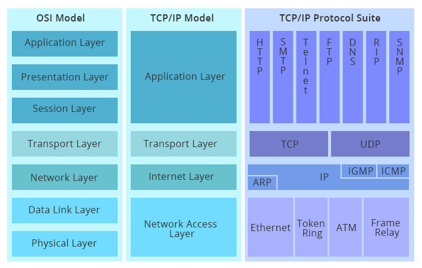


[_OSI vs TCP/IP_](https://community.fs.com/blog/tcpip-vs-osi-whats-the-difference-between-the-two-models.html)


I will be using and referring to this model with its associated protocols throughout the article.


Any data sent from an application to another will have to travel up and down through these layers a few numbers of times (depending on how many middlemen there are). Of course, this happens incredibly fast nowadays, however, it still does happen and understanding the overview of the process is something that every developer should know. The following is an image representation of network process between a server and a client application:


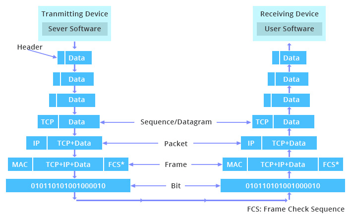


Take this example - a user requesting to browse a page using their browser:

- The request is first sent to the application layer, where it is processed from layer to layer down with each layer performing its designated functions.
- The data is then transmitted over the physical layer of the network until the destination server or another device receives it.
- At this point the data is passed up through the layers again, each layer performing its assigned operations until the data is used by the web server software.
- This process is repeated again for the response of the server.

In general, this is how machines communicate over the network!


### **High-level abstraction of a browser**


The later sections of the article will be covering how a typical browser displays the content of a page on screen. A high-level understanding of the browser is important when reading those sections. I will be referencing some of the following browser components:

- **The user interface:** this includes the address bar, back/forward button, bookmarking menu, etc. Every part of the browser display except the window where you see the requested page.
- **The browser engine:** marshals actions between the UI and the rendering engine.
- **The rendering engine:** responsible for displaying requested content. For example, if the requested content is HTML, the rendering engine parses HTML and CSS and displays the parsed content on the screen.
- **Networking:** for network calls such as HTTP requests, using different implementations for different platforms behind a platform-independent interface.
- **UI backend:** used for drawing basic widgets like combo boxes and windows. This backend exposes a generic interface that is not platform-specific. Underneath it uses operating system user interface methods.
- **JavaScript interpreter:** Used to parse and execute JavaScript code.
- **Data storage:** This is a persistence layer. The browser may need to save all sorts of data locally, such as cookies. Browsers also support storage mechanisms such as localStorage, IndexedDB, WebSQL and FileSystem.

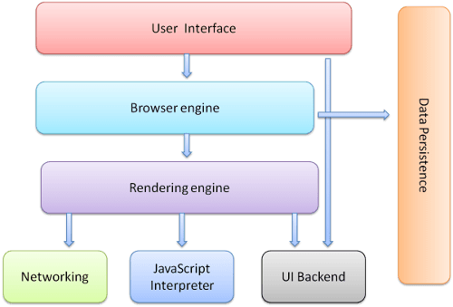


[_Browser Components_](https://www.html5rocks.com/en/tutorials/internals/howbrowserswork/)


It is important to note that browsers such as Chrome have a multi-process approach for performance and security reasons. This means that they run instances of some of these components, such as the rendering engine, for each tab (each tab is a separate process). You can find proof of this by checking chrome's processes in a task manager.


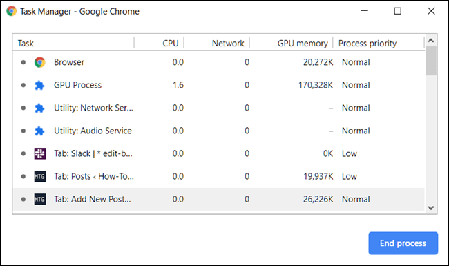


[_Screenshot of Chrome's Task Manager_](https://dev.to/gitpaulo/journey-of-a-web-page-how-browsers-work-10co#)


As you can observe from the screenshot above, each tab has a process priority and CPU/Network/GPU statistics implying that they work like normal processes. That is because they do! You can further confirm this by listing your OS's processes and you will surely find them there.


To conclude this background section, it is important to note that what you just read so far is a **very** high-level generalisation and abstraction of how networks and browsers actually work. Not all networks strictly abide by the OSI/TCP IP models and the main browsers in use today are all different in their own ways but share a common base of concepts that allows us to abstract them to what you've just read.

- For browsers, as an example, they all follow (to some degree) the specifications maintained by the [W3C (World Wide Web Consortium) organization](https://www.w3.org/), which is the standards organization for the web. However, their rendering engines are different, Internet Explorer uses Trident, Firefox uses Gecko, Safari uses WebKit. Chrome, Edge and Opera use Blink, a fork of WebKit.

## **Journey of a page**


You open up a browser and type in [www.google.com](http://www.google.com/). This is what happens.


### Navigation


The first step is navigating to the correct place. Navigating to a web page is finding where the assets for that page are located. To us, web pages are simply domain names, but to computers, they resolve into IP addresses.


[_IP_](https://dev.to/gitpaulo/journey-of-a-web-page-how-browsers-work-10co#)


If you navigate to [www.google.com](http://www.google.com/), the page resources will be located on a server with an IP address such as 93.184.216.34 (of sorts). If you’ve never visited this site, a Domain Name System (DNS) lookup must happen


### **Round Trip Time**


[Round-trip time (RTT)](https://en.wikipedia.org/wiki/Round-trip_delay) is the duration, measured in milliseconds, from when a browser sends a request to when it receives a response from a server. It's a key performance metric for web applications and one of the main factors, along with [Time to First Byte (TTFB)](https://developer.mozilla.org/en-US/docs/Glossary/time_to_first_byte), when measuring page load time and network latency.


I will be annotating each network process with their corresponding RTT.


### **Resolving a web address - The DNS Process (O RTT)**


An overview of the DNS process for `www.google.com` is as follows:

- Check browser & OS cache, return if IP found.
- Browser sends out a request asking for a DNS resolver.
	1. DNS resolver checks its cache, return if IP is found.
- DNS resolver sends out a request asking root nameservers.
- A root nameserver responds to the DNS resolver with an IP address to a TLD nameserver (in this case the TLD for extensions of `.com`).
- DNS resolver sends out another request, now to the TLD nameserver, asking if they know what the IP is.
- TLD nameserver responds back to the DNS resolver with an IP of the authoritative nameserver.
- DNS resolver sends out the final request to the authoritative nameserver asking for the IP.
- The authoritative nameserver will scan zones files to find the domain name:ipaddress mapping and will return whether it exists or not to the DNS resolver.
- Finally, the DNS resolver will now respond back to the browser with the IP of the server the browser is trying to communicate.

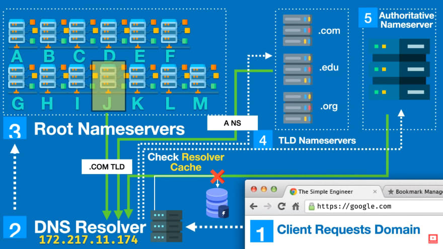


[_Visualisation of the DNS process_](https://youtu.be/vrxwXXytEuI)


Note that this process is usually incredibly fast and rarely follows through in its entirety because of all the layers of caching. It was designed to be fast!


### Establishing a connection to the server - TCP Handshake (1 RTT)


Now that the IP address is known, the browser sets up a connection to the server via a [TCP three-way handshake](https://www.sciencedirect.com/topics/computer-science/three-way-handshake).


[TCP](https://en.wikipedia.org/wiki/Transmission_Control_Protocol) uses a three-way handshake to establish a reliable connection. The connection is full-duplex, and both sides synchronize (SYN) and acknowledge (ACK) each other. The exchange of these four flags is performed in three steps—SYN, SYN-ACK, and ACK—as shown in


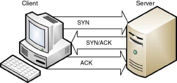


[_TCP 3-way handshake_](https://www.sciencedirect.com/topics/computer-science/three-way-handshake)

- The client chooses an initial sequence number, set in the first SYN packet.
- The server also chooses its own initial sequence number.
- Each side acknowledges the other's sequence number by incrementing it; this is the acknowledgement number.

Once a connection is established, ACKs typically follow for each segment. The connection will eventually end with an RST (reset or tear down the connection) or FIN (gracefully end the connection).


This mechanism is designed so that two entities attempting to communicate, in this case, the browser and web server, can negotiate the parameters of the network TCP socket connection before transmitting data, in our case, it will be over HTTPS—the secure version of [HTTP](https://developer.mozilla.org/en-US/docs/Web/HTTP).


HTTPS is HTTP with encryption. The only difference between the two protocols is that HTTPS uses [TLS (SSL)](https://en.wikipedia.org/wiki/Transport_Layer_Security) to encrypt normal HTTP requests and responses. As a result, HTTPS provides a solid layer of security over HTTP. A website that uses HTTP has `HTTP://` in its URL, while a website that uses HTTPS has `HTTPS://`.


### Establishing a security protocol - TLS Negotiation (~2 RTT)


For secure connections established over HTTPS, another "handshake" is required. This handshake, or rather the TLS negotiation, determines which cypher will be used to encrypt the communication, verifies the server, and establishes that a secure connection is in place before beginning the actual transfer of data.


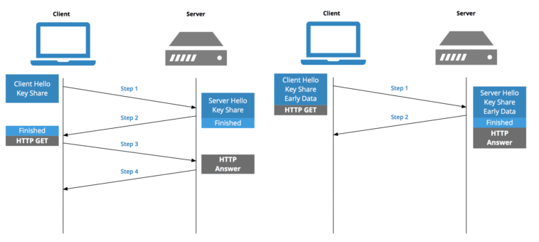


[_Modern day TLS establishing_](https://blog.cloudflare.com/keyless-ssl-the-nitty-gritty-technical-details/)


While making the connection secure adds time to the page load, a secure connection is worth the latency expense, as the data transmitted between the browser and the web server cannot normally be decrypted by a third party. TLS has come a long way and version 1.3 upwards has reduced the Round Trip Time (RTT) from 4 all the way to 2 or even 1 depending on the situation.


Assuming DNS is instantaneous and adding in the HTTP fetch RTT (next section), this leaves 4 round trips before the browser can start showing the page. If you’re visiting a site you’ve recently connected to, the TLS handshake phase can be shortened from 2 round trips to 1 with [TLS session resumption](https://blog.cloudflare.com/tls-session-resumption-full-speed-and-secure/).

- New Connection: 4 RTT + DNS
- Resumed Connection: 3 RTT + DNS

### Fetching


Now that we have a TCP connection setup and the TLS exchange has been completed, the browser can now begin to fetch the page's resources. It starts by fetching the markup document for the page. It does this by using the [HTTP protocol](https://developer.mozilla.org/en-US/docs/Web/HTTP). HTTP requests are sent via TCP/IP and in our case encrypted with Transport Layer Security (TLS)—since google uses HTTPS.


### HTTP Request


To fetch a page an [idempotent](https://www.restapitutorial.com/lessons/idempotency.html) (not changing the server state) request is made. We use the HTTP GET request.

- `GET`—Requests information from a given server using a [Uniform Resource Identifier (URI)](https://en.wikipedia.org/wiki/Uniform_Resource_Identifier). Specification [correct implementations](https://datatracker.ietf.org/doc/html/rfc7231#section-4.3.1) of the GET method only retrieve data and do not cause changes in the source state. No matter how many times you request the same resource, you will never cause a change in state.

There are many other types of HTTP methods:


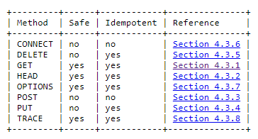


[_HTTP Methods as per sepecification_](https://datatracker.ietf.org/doc/html/rfc7231#section-8.1.3)


For fetching our page we are only interested in `GET`.


```text
GET / HTTP/2
Host: www.google.com
User-Agent: Mozilla/5.0 (Windows NT 10.0; Win64; x64; rv:89.0) Gecko/20100101 Firefox/89.0
Accept: text/html,application/xhtml+xml,application/xml;q=0.9,image/webp,*/*;q=0.8
Accept-Language: en-GB,en;q=0.5
Accept-Encoding: gzip, deflate, br
Connection: keep-alive
Upgrade-Insecure-Requests: 1
Cache-Control: max-age=0
TE: Trailers

```


### HTTP Response


Once the webserver receives the request. It will parse the request and try to fulfil it. We assume the request is valid and the files are available. It will reply with an HTTP response, attaching the relevant headers and the contents of the requested HTML document to the body of that response structure.


```text
HTTP/2 200 OK
date: Sun, 18 Jul 2021 00:26:11 GMT
expires: -1
cache-control: private, max-age=0
content-type: text/html; charset=UTF-8
strict-transport-security: max-age=31536000
content-encoding: br
server: gws
content-length: 37418
x-xss-protection: 0
x-frame-options: SAMEORIGIN
domain=www.google.com
priority=high
X-Firefox-Spdy: h2

```

- the source code of the HTML document will be in the body of the response.

### Parsing


Once the browser receives the response, it can begin parsing the information received. Parsing is the step the browser takes to turn the data it receives over the network into the DOM and CSSOM, which is used by the renderer to paint a page to the screen.


The [Document Object Model (DOM)](https://en.wikipedia.org/wiki/Document_Object_Model) is an internal representation of the objects that comprise the structure and content of the markup (HTML in this case) document the browser just received. It represents the page so that programs can change the document structure, style, and content.


The DOM represents the document as nodes and objects. That way, programming languages can connect to the page. There are many different types of nodes in a DOM tree. An example part of the specification for the [DOM Node Interface](https://developer.mozilla.org/en-US/docs/Web/API/Node) looks as follows:

- `Node.ELEMENT_NODE`
- `Node.ATTRIBUTE_NODE`
- `Node.TEXT_NODE`
- `Node.CDATA_SECTION_NODE`
- `Node.PROCESSING_INSTRUCTION_NODE`
- `Node.COMMENT_NODE`
- `Node.DOCUMENT_NODE`
- `Node.DOCUMENT_TYPE_NODE`
- `Node.DOCUMENT_FRAGMENT_NODE`
- `Node.NOTATION_NODE`

These node types cover all possible nodes in the document. Such representations help programming languages connect to the page so that they can manipulate it.


To conclude our parsing preface, we need to talk about the CSSOM.


The [CSS Object Model (CSSOM)](https://developer.mozilla.org/en-US/docs/Web/API/CSS_Object_Model) is a set of APIs allowing the manipulation of CSS from JavaScript. It is much like the DOM, but for the CSS rather than the HTML. It allows users to read and modify CSS style dynamically. It is represented very similarly to the DOM, as a tree, and it will be used along with the DOM to form a render tree so that the browser can begin its rendering process. Let's find out how by going through the entire process.


### Building the DOM tree


The first step is processing the HTML markup and building the DOM tree. HTML parsing involves tokenization and tree construction.


HTML may come as a surprise in the world of parsing as it cannot be parsed through conventional means as it cannot be defined by a [Context Free Grammar (CFG)](https://en.wikipedia.org/wiki/Context-free_grammar). Instead, there is a formal format for defining HTML which is called the [Document Type Definition (DTD)](https://en.wikipedia.org/wiki/Document_type_definition). I will not be going too much into detail about how this is done but the main reasons for this are:

- The forgiving nature of the language.
- The fact that browsers have traditional error tolerance to support well-known cases of invalid HTML.
- The parsing process is reentrant. For other languages, the source doesn't change during parsing, but in HTML, dynamic code (such as script elements containing `document.write()` calls) can add extra tokens, so the parsing process actually modifies the input.

Unable to use the regular parsing techniques, browsers create custom parsers for parsing HTML.


The parsing algorithm is described in detail by the [HTML5 specification](https://html.spec.whatwg.org/multipage/parsing.html). As previously mentioned, the algorithm consists of two stages: tokenization and tree construction.

- **Tokenization** is the lexical analysis, parsing the input into tokens. Among HTML tokens are start tags, end tags, attribute names and attribute values.
- **Tree construction** is essentially creating a tree-based of the parsed tokens and what we will be focusing on—The DOM tree.

The DOM tree describes the content of the document. The `<html>` element is the first tag and root node of the document tree. The tree reflects the relationships and hierarchies between different tags. Tags nested within other tags are child nodes. The greater the number of DOM nodes, the longer it takes to construct the DOM tree. Below you can find a visual representation of the DOM tree—The output of the parser:


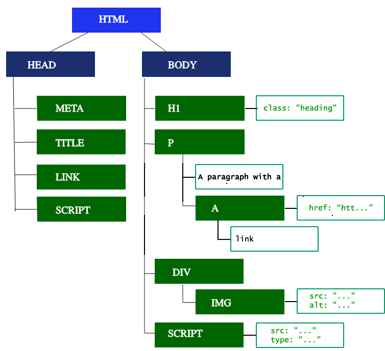


[_Part of the DOM Tree_](https://dev.to/gitpaulo/journey-of-a-web-page-how-browsers-work-10co#)


When the parser finds non-blocking resources, such as an image, the browser will request those resources and continue parsing. Parsing can continue when a CSS file is encountered, but `<script>` tags—particularly those without an async or defer attribute—block rendering, and pause the parsing of HTML. Though the browser's preload scanner hastens this process, excessive scripts can still be a significant bottleneck.


### Building the CSSOM tree


The second step is processing CSS and building the CSSOM tree. In a similar fashion to the DOM parsing phase, the browser goes through each rule set in the CSS, creating a tree of nodes with parent, child, and sibling relationships based on the CSS selectors.


In regards to parsing, well, unlike HTML, CSS is a context-free grammar and can be parsed using regular CFG parsing techniques. In fact the [CSS specification defines CSS lexical and syntax grammar](https://www.w3.org/TR/CSS21/grammar.html).


As with HTML, the browser needs to convert the received CSS rules into something it can work with. From there, it repeats the HTML-to-object process, but for the CSS.


### Combining the trees into the render tree


The CSSOM and DOM trees are combined into a render tree, which is then used to compute the layout of each visible element and serves as an input to the paint process that renders the pixels to the screen.


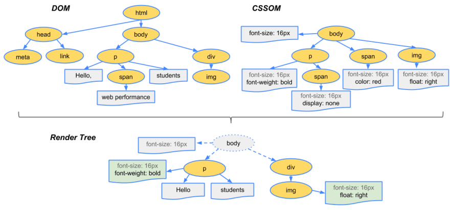


[_Combining the CSSOM + DOM trees to make the render tree_](https://dev.to/gitpaulo/HERE%20LINK)


To construct the render tree, the browser roughly does the following:

- Starting at the root of the DOM tree, traverse each visible node.
	- Some nodes are not visible (for example, script tags, meta tags, and so on), and are omitted since they are not reflected in the rendered output.
	- Some nodes are hidden via CSS and are also omitted from the render tree; for example, the span node—in the example above—is missing from the render tree because we have an explicit rule that sets the "display: none" property on it.
- For each visible node, find the appropriate matching CSSOM rules and apply them.
- Emit visible nodes with content and their computed styles.

The final output is a render that contains both the content and style information of all the visible content on the screen. With the render tree in place, we can proceed to the "layout" stage.


### Preload Scanner


While the browser's main thread is busing building the DOM tree it has a helper worker scan through the content available. This helper is the [preload scanner](https://ariya.io/2013/04/css-preload-scanner-in-webkit) and will prepare high priority fetch request for resources like CSS, JavaScript, and web fonts. This is an optimization added over the parsing stage as it would take far too long to make these requests as the parser finds references to them.


```html
<link rel="stylesheet" src="styles.css"/>
<script src="myscript.js" async></script>

<script src="anotherscript.js" async></script>

```


Taking the example above, the preload scanner will try to find the scripts and images, and start downloading them. There are ways to communicate to the preload scanner via the HTML—the attributes: `async` and `defer`.

- `async`: When present, it specifies that the script will be executed asynchronously as soon as it is available.
- `defer`: When present, it specifies that the script is executed when the page has finished parsing.

Waiting to obtain CSS doesn't block HTML parsing or downloading, but it does block JavaScript because JavaScript is often used to query CSS properties’ impact on elements.


### JavaScript Compilation


While the CSS is being parsed and the CSSOM created, other assets, including JavaScript files, are downloading (thanks to the preload scanner). JavaScript is interpreted, compiled, parsed and executed.


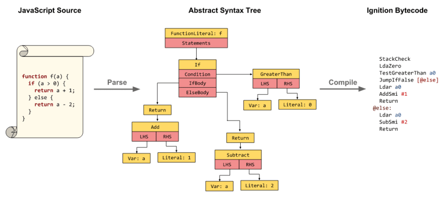


[_Overview of the JS compilation process_](https://v8.dev/blog/background-compilation)


The scripts are parsed into [abstract syntax trees](https://en.wikipedia.org/wiki/Abstract_syntax_tree). Like in the above diagram (from V8's engine blog), some browser engines take the Abstract Syntax Tree and pass it into an interpreter, outputting bytecode which is executed on the main thread. This is known as JavaScript compilation.


### Building the Accessibility Tree


The browser also builds an accessibility tree that assistive devices use to parse and interpret content. The [accessibility object model (AOM)](https://wicg.github.io/aom/explainer.html) is like a semantic version of the DOM. The browser updates the accessibility tree when the DOM is updated. The accessibility tree is not modifiable by assistive technologies themselves.


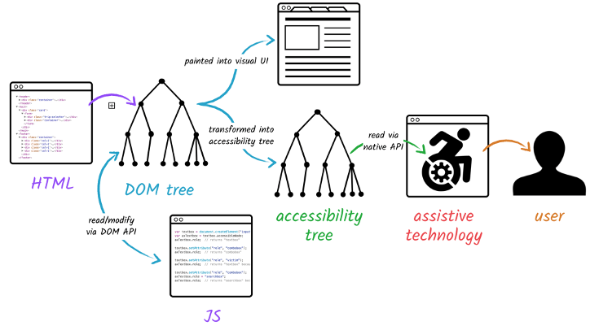


[_Build and use process of the AOM_](https://dev.to/gitpaulo/journey-of-a-web-page-how-browsers-work-10co#)


Until the AOM is built, the content is not accessible to screen readers.


### Rendering


Now that the information has been parsed the browser can begin to display it. To achieve this the browser will now use the render tree to produce a visual representation of the document. Rendering steps include layout, paint and, in some cases, compositing.


### Critical Rendering Path


Now is a good time to introduce the notion of the [Critical Rendering Path](https://developer.mozilla.org/en-US/docs/Web/Performance/Critical_rendering_path). The best way to visualise it is with a diagram:


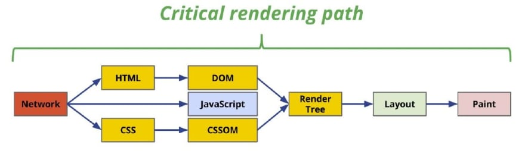


[_The Critical Rendering Path_](https://guillermo.at/browser-critical-render-path)


Optimizing the critical rendering path improves the time to first render. It is important to ensure reflows and repaints can happen at the [goal of 60 frames per second](https://developer.mozilla.org/en-US/docs/Web/API/Frame_Timing_API) (for performant user interactions).


We won't be going into detail on how to optimise the CRP but the general gist relies on improving page load speed by prioritizing which resources get loaded, controlling the order in which they are loaded, and reducing the file sizes of those resources.


Now let's move on to the rendering stages.


### Layout


Layout is the first rendering stage, where the geometry and positioning of the render tree nodes are determined. Once the render tree is built, the layout commences.


Layout is a recursive process. It begins at the root renderer, which corresponds to the `<html>` element of the HTML document. Layout continues recursively through some or all of the frame hierarchy, computing geometric information for each renderer that requires it.


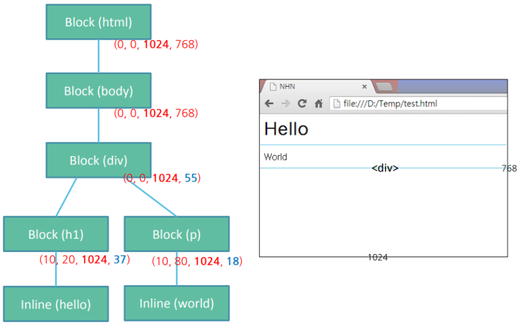


[_Layout stage_](https://dev.to/gitpaulo/journey-of-a-web-page-how-browsers-work-10co#)


At the end of the layout stage, a tree similar to the one above is generated with what we call blocks/Coxes as nodes. Blocks/Boxes hold the geometric information of DOM objects and nodes.


### Dirty bit system


In order not to do a full layout for every small change, browsers use a "dirty bit" system. A renderer that is changed or added marks itself and its children as "dirty": needing layout.


There are two flags:- **dirty:** node needs a layout.- **children are dirty:** node has at least one child that needs a layout.


### Layout Algorithm


Using the dirty bit system browsers can now perform an algorithm to generate the layout. A high-level abstraction of that algorithm is as folows:

- Parent node determines its own width.
- Parent goes over children and:
	1. Calculate child render's size
	2. Calls child layout if they have a dirty descendant
- Parent uses children's accumulative heights and the heights of margins and padding to set its own height–this will be used by the parent renderer's parent.
- Sets its dirty bit to false.

An added important concept is that of **reflow**. As previously mentioned, the first time the size and position of nodes are determined is called **layout**. Subsequent recalculations of node size and locations are called **reflows**. As an example, suppose the initial layout occurs before the image is returned. Since we didn't declare the size of our image, there will be a reflow once the image size is known!


### Paint


The third and last stage of rendering. In this painting phase, the browser converts each box calculated in the layout phase to actual pixels on the screen. Painting involves drawing every visual part of an element to the screen, including text, colours, borders, shadows, and replaced elements like buttons and images. The browser needs to do this super quickly.


### Painting order


[CSS2 defines the order of the painting process](https://www.w3.org/TR/CSS21/zindex.html). This is actually the order in which the elements are stacked in the stacking contexts. This order affects painting since the stacks are painted from back to front. The stacking order of a block renderer is:

- background colour
- background image
- border
- children
- outline

### Paint Layers


Painting can break the elements in the layout tree into layers. Promoting content into layers on the GPU (instead of the main thread on the CPU) improves paint and repaint performance. There are specific properties and elements that instantiate a layer, including `<video>` and `<canvas>`, and any element which has the CSS properties of opacity, a 3D transform, will-change, and a few others. These nodes will be painted onto their own layer, along with their descendants, unless a descendant necessitates its own layer for one (or more) of the above reasons.


Layers do improve performance but are expensive when it comes to memory management, so should not be overused as part of web performance optimization strategies.


### Compositing


When sections of the document are drawn in different layers, overlapping each other, compositing is necessary to ensure they are drawn to the screen in the right order and the content is rendered correctly.


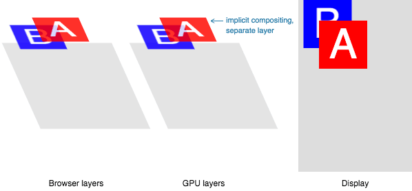


[_Compositing stage_](https://dev.to/gitpaulo/journey-of-a-web-page-how-browsers-work-10co#)


As the page continues to load assets, reflows can happen ([recall our example image that arrived late](https://dev.to/gitpaulo/journey-of-a-web-page-how-browsers-work-10co#overview-of-layout-process)). A reflow sparks a repaint and a re-composite. Had we defined the size of our image, no-reflow would have been necessary, and only the layer that needed to be repainted would be repainted, and composited if necessary. But we didn't include the image size! When the image is obtained from the server, the rendering process goes back to the layout steps and restarts from there.


### Finalising


Once the main thread is done painting the page, you would think we would be "all set." That isn't necessarily the case. If the load includes JavaScript, which was correctly deferred, and only executed after the onload event fires, the main thread might be busy, and not available for scrolling, touch, and other interactions.


### JavaScript Occupied


[Time to Interactive (TTI)](https://web.dev/interactive/) is the measurement of how long it took from that first request which led to the DNS lookup and SSL connection to when the page is interactive—interactive being the point in time after the [First Contentful Paint](https://developer.mozilla.org/en-US/docs/Glossary/First_contentful_paint) when the page responds to user interactions within 50ms. If the main thread is occupied parsing, compiling, and executing JavaScript, it is not available and therefore not able to respond to user interactions in a timely ([less than 50ms](https://developer.mozilla.org/en-US/docs/Web/Performance/How_long_is_too_long)) fashion.


In our example, maybe the image loaded quickly, but perhaps the anotherscript.js file was 2MB and our user's network connection was slow. In this case, the user would see the page super quickly, but wouldn't be able to scroll without jank until the script was downloaded, parsed and executed. That is not a good user experience. Avoid occupying the main thread, as demonstrated in this WebPageTest example:


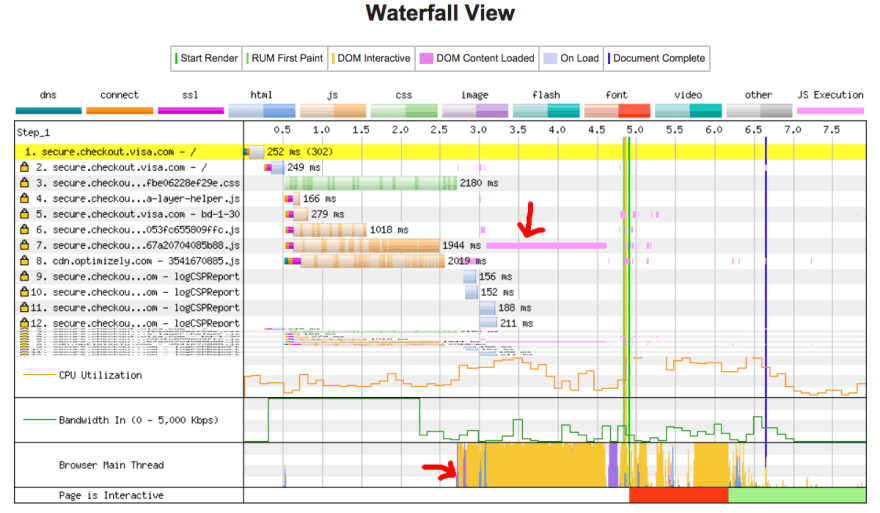


[_Example - JavaScript hogging main thread_](https://dev.to/gitpaulo/journey-of-a-web-page-how-browsers-work-10co#)


In this example, the DOM content load process took over 1.5 seconds, and the main thread was fully occupied that entire time, unresponsive to click events or screen taps.


### The user can now browse the page! 🎉


Yes, after all these stages the user can now both see and interact with the page!


## Summary


For a simple page to be displayed in our browser window it may need to go through:

- DNS Lookup: To find out the IP of the web address.
- TCP Handshake: To set up TCP/IP communication between the client and server for the subsequent steps.
- TLS Handshake: To safeguard the information that will be sent via encryption.
- HTTP communication: To establish a method of communication that browsers can understand.
- Browser Parsing: To parse the HTTP's response—the document of the page to be displayed.
- Browser Rendering: To render the document on the browsers window.
- Javascript Occupied: To wait for JS to compile and execute as it may hog the main thread.

It is incredible the number of things that happen for this seemingly simple task to be accomplished. Truly an impressive journey for our little page :)


### There is more...


In a real-world scenario, our little page may have to tackle even more obstacles before reaching its destination things such as [load balancers, proxies](https://www.nginx.com/resources/glossary/load-balancing/), [multiple layers of firewalls](https://www.nginx.com/resources/glossary/what-is-a-waf/), etc...


These topics are beasts of their own and if you're curious about how they work I recommend looking them up! Perhaps I'll write something for them in the future.


## Reference


[https://dev.to/gitpaulo/journey-of-a-web-page-how-browsers-work-10co](https://dev.to/gitpaulo/journey-of-a-web-page-how-browsers-work-10co)

