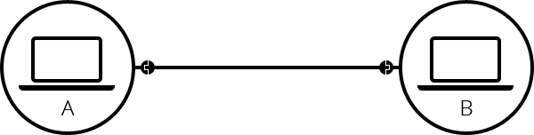
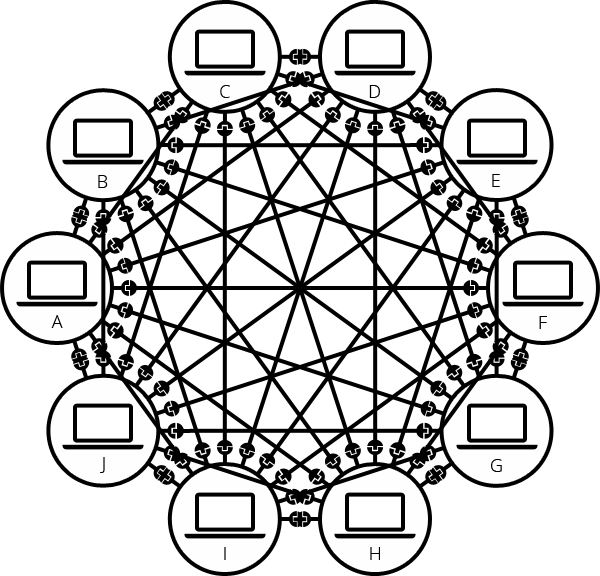
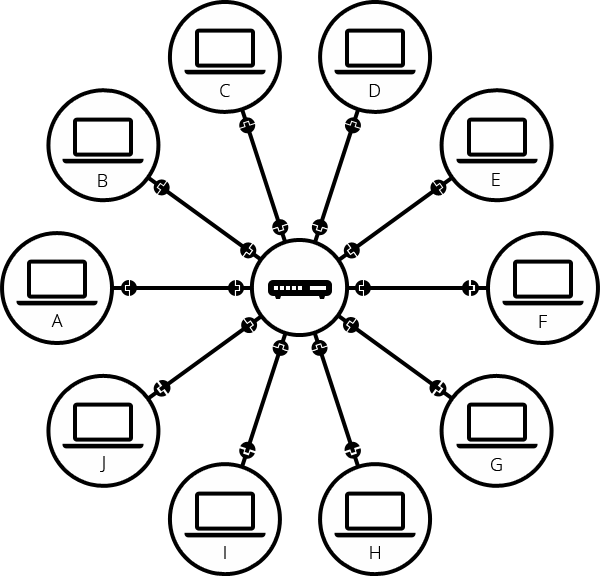
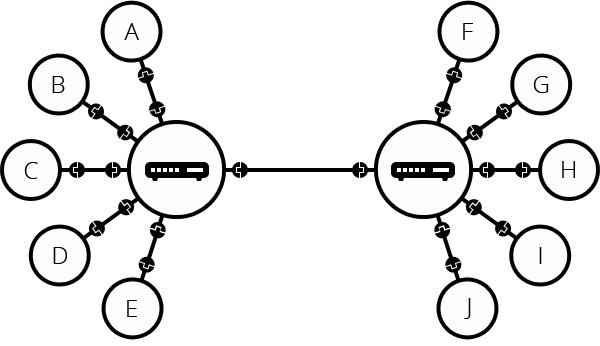
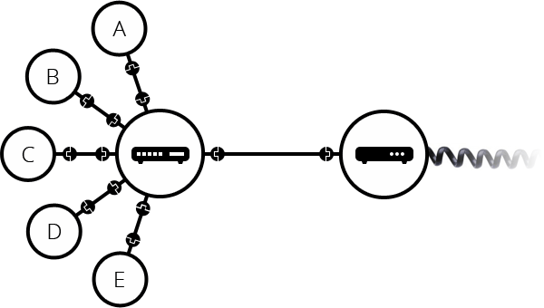
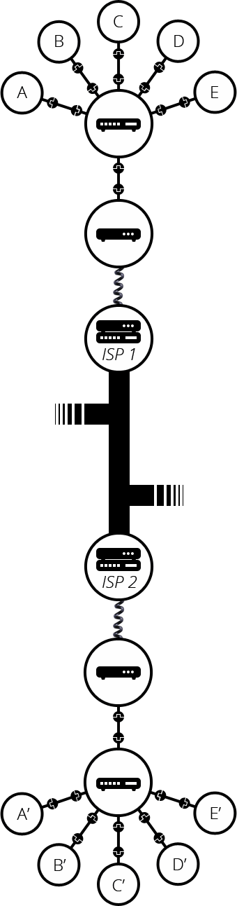
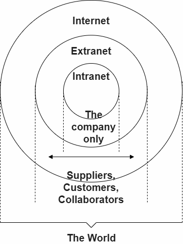

## Summary

The **Internet** is the backbone of the Web, the technical infrastructure that makes the Web possible. At its most basic, the Internet is a large network of computers that communicate altogether.

[The history of the Internet is somewhat obscure](https://en.wikipedia.org/wiki/Internet#History). It began in the 1960s as a US-army-funded research project, then evolved into a public infrastructure in the 1980s with the support of many public universities and private companies. The various technologies that support the Internet have evolved over time, but the way it works hasn't changed that much: the Internet is a way to connect computers altogether and ensure that, whatever happens, they find a way to stay connected.

## Deeper dive

### A simple network

When two computers need to communicate, you have to link them, either physically (usually with an [Ethernet cable](https://en.wikipedia.org/wiki/Ethernet_crossover_cable)) or wirelessly (for example with [Wi-Fi](https://en.wikipedia.org/wiki/WiFi) or [Bluetooth](https://en.wikipedia.org/wiki/Bluetooth) systems). All modern computers can sustain any of those connections.

Such a network is not limited to two computers. You can connect as many computers as you wish. But it gets complicated quickly. If you're trying to connect, say, ten computers, you need 45 cables, with nine plugs per computer!

To solve this problem, each computer on a network is connected to a special tiny computer called a _router_. This _router_ has only one job: like a signaler at a railway station, it makes sure that a message sent from a given computer arrives at the right destination computer. To send a message to computer B, computer A must send the message to the router, which in turn forwards the message to computer B and makes sure the message is not delivered to computer C.

Once we add a router to the system, our network of 10 computers only requires 10 cables: a single plug for each computer and a router with 10 plugs.

### A network of networks

So far so good. But what about connecting hundreds, thousands, billions of computers? Of course a single _router_ can't scale that far, but, if you read carefully, we said that a _router_ is a computer like any other, so what keeps us from connecting two _routers_ together? Nothing, so let's do that.

Such a network comes very close to what we call the Internet, but we're missing something. We built that network for our own purposes. There are other networks out there: your friends, your neighbors, anyone can have their own network of computers. But it's not really possible to set cables up between your house and the rest of the world, so how can you handle this? Well, there are already cables linked to your house, for example, electric power and telephone. The telephone infrastructure already connects your house with anyone in the world so it is the perfect wire we need. To connect our network to the telephone infrastructure, we need a special piece of equipment called a _modem_. This _modem_ turns the information from our network into information manageable by the telephone infrastructure and vice versa.

So we are connected to the telephone infrastructure. The next step is to send the messages from our network to the network we want to reach. To do that, we will connect our network to an Internet Service Provider (ISP). An ISP is a company that manages some special _routers_ that are all linked together and can also access other ISPs' routers. So the message from our network is carried through the network of ISP networks to the destination network. The Internet consists of this whole infrastructure of networks.

### Finding computers

If you want to send a message to a computer, you have to specify which one. Thus any computer linked to a network has a unique address that identifies it, called an "IP address" (where IP stands for _Internet Protocol_). It's an address made of a series of four numbers separated by dots, for example, `192.168.2.10`.

That's perfectly fine for computers, but we human beings have a hard time remembering that sort of address. To make things easier, we can alias an IP address with a human-readable name called a _domain name_. For example (at the time of writing; IP addresses can change) `google.com` is the domain name used on top of the IP address `142.250.190.78`. So using the domain name is the easiest way for us to reach a computer over the Internet.

### Internet and the web

As you might notice, when we browse the Web with a Web browser, we usually use the domain name to reach a website. Does that mean the Internet and the Web are the same thing? It's not that simple. As we saw, the Internet is a technical infrastructure which allows billions of computers to be connected all together. Among those computers, some computers (called _Web servers_) can send messages intelligible to web browsers. The _Internet_ is an infrastructure, whereas the _Web_ is a service built on top of the infrastructure. It is worth noting there are several other services built on top of the Internet, such as email and [IRC](https://developer.mozilla.org/en-US/docs/Glossary/IRC).

### Intranets and Extranets

Intranets are _private_ networks that are restricted to members of a particular organization. They are commonly used to provide a portal for members to securely access shared resources, collaborate and communicate. For example, an organization's intranet might host web pages for sharing department or team information, shared drives for managing key documents and files, portals for performing business administration tasks, and collaboration tools like wikis, discussion boards, and messaging systems.

Extranets are very similar to Intranets, except they open all or part of a private network to allow sharing and collaboration with other organizations. They are typically used to safely and securely share information with clients and stakeholders who work closely with a business. Often their functions are similar to those provided by an intranet: information and file sharing, collaboration tools, discussion boards, etc.

Both intranets and extranets run on the same kind of infrastructure as the Internet, and use the same protocols. They can therefore be accessed by authorized members from different physical locations.

## References

[https://developer.mozilla.org/en-US/docs/Learn/Common_questions/How_does_the_Internet_work#deeper_dive](https://developer.mozilla.org/en-US/docs/Learn/Common_questions/How_does_the_Internet_work#deeper_dive)

